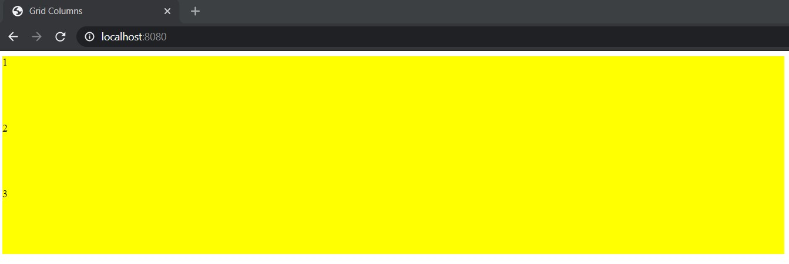
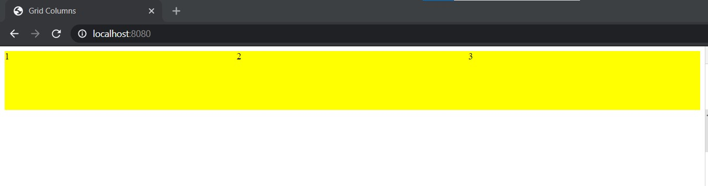
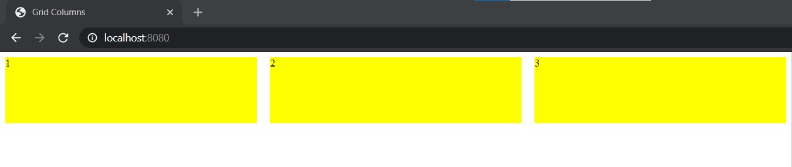

## Create responsive columns

Create a container and three children. These three children each will occupy 33% available width. We are going to use css grid to create this columns like structure. We are adding background and height to make better visual comparison.
```html
 <div class="container">
      <div class="item">1</div>
      <div class="item">2</div>
      <div class="item">3</div>
    </div>

<style>
.item {
    height: 100px;
    background: yellow;
}
</style>
```
So it will look like this.



Let's add `display:grid` property to the container. We will use `grid-template-columns` property to specify children responsive widths.

```css
.container {
    display: grid;
    grid-template-columns: auto auto auto;
}
```
Now three-item children each should take 33% width available on the screen. Make sure to match the number of children and their width in `grid-template-columns`. The width taken by children is responsive. So it will be relative to their parent width. It will take the respective % width available to their parent element.

Now it will look like this -



Using `grid-template-columns` you can specify number of columns and their widths for a grid container element. What if you want to add some gap between those columns without specifying external margin ? We can use `grid-gap` for that. Let's add 20px gap between these columns.
```css
.container {
    display: grid;
    grid-template-columns: auto auto auto;
    grid-gap: 20px;
}
```

Now it will look like this -




CSS grid is a powerful feature to create complex responsive layouts. We don't need special library to create responsive layouts if we take advantage of features like CSS grid and flexbox.
