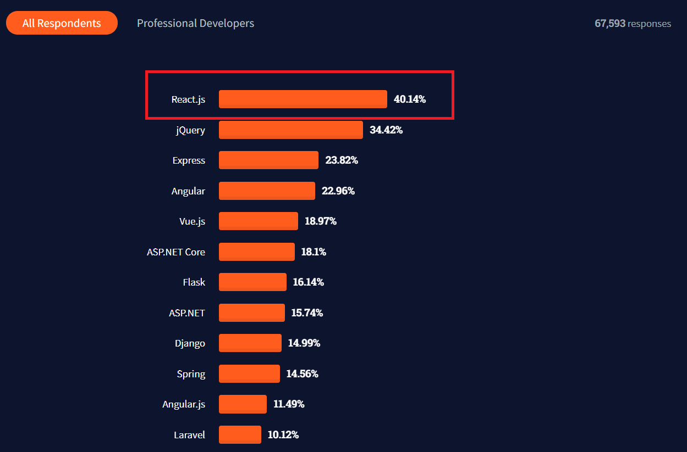
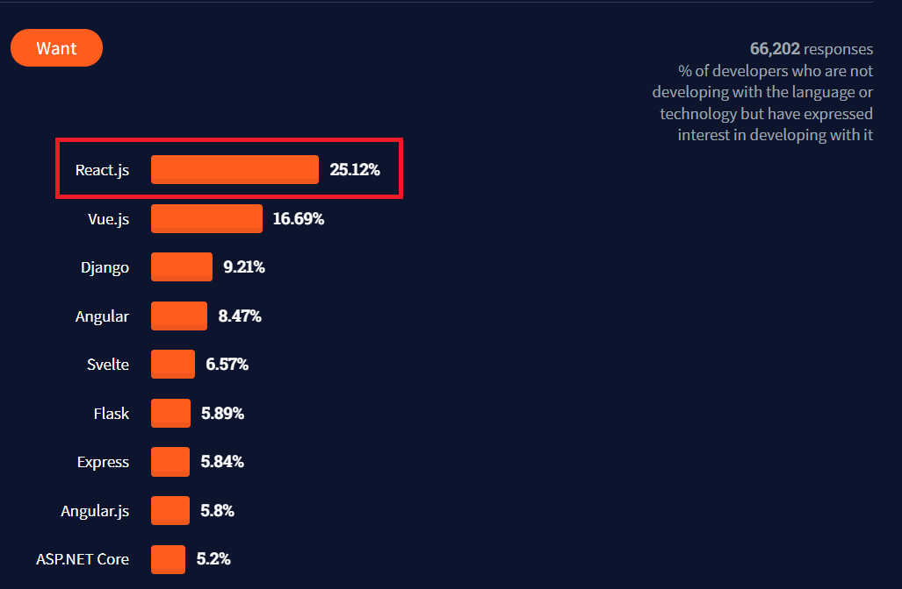

`React.js` (also known as `React`) is an `open-source JavaScript library` that is used for building user interfaces, which are often single-page applications. The main principle of React is the creation and use of reusable UI components, which makes development easier and the user experience better.

While using React, we approach building user interfaces by breaking them into `components`. Components are independent, reusable bits of code, which can be used dynamically to fill in variable data.

React also makes extensive use of JSX syntax, which stands for JavaScript XML. JSX allows us to write JavaScript code inside HTML elements, by enclosing the JS expression or React variable within curly braces, i.e. { } .


# Why was it created?
Back in 2001, the development team at Facebook started facing issues with maintaining code. With the Facebook Ads app's increase in the number of features, the app became increasingly difficult to handle. The development team could not keep up with the updates, and soon there was an urgent need of upgrading the code base to make the development process as well as the user experience more seamless.

So Jordan Walke, a software engineer at Facebook, created FaxJS which was an early prototype of React. Soon afterwards, Instagram got acquired by Facebook. Now, Instagram was keen to adopt Facebook's new technology as well. All this urged Facebook to decouple React from Facebook and make it open-sourceable.

Finally, React got open-sourced in the JS ConfUS 2013, which changed the game for Facebook. Mobile experience got better, even more so with the addition of `React Native` in 2015. Thus, React became popular amongst developers, which appealed to big enterprises such as Netflix, Airbnb to use React.

### How did React.js stand in the Stack Overflow 2021 Developer Survey?

This year, React.js surpassed JQuery and emerged as the **most commonly used web library**!


In addition to the huge number of existing React developers, it continues to be the **most wanted web library**, desired by one in four developers.



# How does React.js make frontend development easier?

## 1. Reusable Components
React makes use of components, which are like reusable LEGO bricks that can be used to build pages by designing and arranging them in various ways to get our desired goal. Component-driven development leads to writing composable and reusable code, and brings consistency throughout the app.

## 2. Data Sharing across Components using State Management
State management allows for communication and sharing of data between components throughout the app. State management in React can be achieved using several tools such as `Redux`, `Hooks`, `MobX`, etc. Sharing state and updating it across your app was one of the main difficulty of writing complex frontend apps. React made it breeze.


## 3. Write Minimal Declarative Code
In React, code is written using `declarative` programming style, as opposed to the imperative programming style in vanilla JS. Declarative programming paradigm focuses more on the WHAT rather than on the HOW. That is, we can specify what is needed on the code quite simply, without having to worry about how i is to be achieved. This can be better understood with an example:

**Eg 1. To square all numbers in an array:**

Imperatively:

```javascript
var numbers = [0,1,2,3,4]
var squares = []

for(var i = 0; i < numbers.length; i++) {
  var square = numbers[i] * numbers[i]
  squares.push(square)
}

```

Declaratively:

```javascript
var numbers = [0,1,2,3,4]

var squares = numbers.map(function(num) {
  return num * num
})

```

**Eg 2. To add a div and heading to the body:**

Imperatively:

```javascript
function addHeadingToBody() {
    const bodyTag = document.querySelector('body')
    const divTag = document.createElement('div')
    let h1Tag = document.createElement('h1')
    h1Tag.innerText = "React is cool"
    divTag.append(h1Tag)
    bodyTag.append(divTag)
  }

```
Declaratively:

```javascript
class MyComponent extends Component {
    render() {
      return(
        <div>
          <h1>React is Cool</h1>
        </div>)
    }
}

```

Clearly, the declarative style of programming makes the code far shorter and simpler.


## 4. Strong Open Source Ecosystem
React enjoys huge community support. React has Libraries for routing, UI components, animations, forms, state management, etc. Most popular UI libraries were ported to React compatible versions. There are multiple choices for libraries on any problem. For instance on State Management, Redux, Mobx, Mobx State Tree, are popular choices. Apart from these there are lot of other libraris who provide the same solution.

## 5. Fast rendering using Virtual DOM
React uses `Virtual DOM`, a JavaScript Object, which is a virtual copy of Real DOM. So on any changes in the UI, React first checks the difference in its present Virtual DOM and previous Virtual DOM and updates only that node in the Real DOM, as opposed to re-rendering the entire DOM. This increases the efficiency and user experience.


## Summary
React.js is without a doubt, one of the best ways for frontend development, since it allows for developing complex applications as big as Facebook, with fine code quality. Backed by the tech giant Facebook as well as a huge open-source community, React is here to stay as a core web technology in the present as well as the future. It is a **must-have** skill as a frontend developer, as it continues to grow in popularity with more and more enterprises adopting React.

