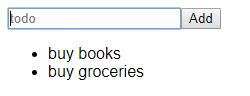

# React Hooks

( A new way of creating components )

Hooks are a very new feature added to React with version 16.8 and this feature lets you use state and other React features without using class. We can still use class-based components, but Hooks give us a new way of writing our React components,

## What are Hooks ?

Hooks offer us a new way of writing our components. We have two kinds of components - Functional Components and Class Components.

### Functional Components:

- Receive props and you return some JSX code that should be rendered to the screen.

- They are great for presentation, not so much for the business logic.

- Focused on one/a few purposes.

### Class-based components

- They also receive props but they also have an internal state.

- Actually hold the majority of business logic

- Orchestrates components.

<b> So what’s the major problem? </b>

1.  If anytime, we need to convert a Functional Component into a Class component or vice versa, then the conversion can become very annoying.

2.  Lifecycle hooks can be hard to use - Knowing which lifecycle hook to use when and where especially for complex applications can be very challenging.

So, wouldn’t it be nice if we had just one way of creating components, which would handle our state, presentation and business logic? Well, this is what Hooks are all about. Hooks let us use functional components, and get rid of class-only functionalities.

### What is a Hook ?

On literal terms, hook means to “attach”. Therefore, Hooks in React are simply functions that let you “hook into” React state and lifecycle features from functional components.

React gives us the independence of using the built-in hooks, such as useState, or to write your own hook.

## Built-in Hooks

### 1. Using the state hook -

<b>Using a single state -</b>
The following example captures user input.

```javascript
import React, { useState } from 'react'

const Todo = props => {
  const [todoname, setTodoName] = useState('')

  const inputChangeHandler = event => {
    setTodoName(event.target.value)
  }

  return (
    <React.Fragment>
      <input
        type="text"
        placeholder="todo"
        value={todoname}
        onChange={inputChangeHandler}
      />
    </React.Fragment>
  )
}

export default Todo
```

Here, `useState` is a Hook. We have called it inside the function component to add some local state to it, that React will preserve in between re-renders.

`useState` takes the initial argument as the input, as you may notice, here we have passed an empty string as the initial state for the todoInput.

`useState` returns an array with 2 elements in it, the first is the current value of the state, and the second is the method that lets you update that value. The function does the same thing, as we used to do with `this.setState` in the class component.

Running this code gives the following result : <br>


<b> Using multiple states</b>
The following code snippet renders the list of the user input on screen. Here, we need 2 states :

1.  That captures the user input
2.  That renders the list on the screen.

```javascript
import React, { useState } from 'react'

const Todo = props => {
  const [todoname, setTodoName] = useState('')
  const [todolist, setTodoList] = useState([])

  const inputChangeHandler = event => {
    setTodoName(event.target.value)
  }

  const todoAddhandler = () => {
    setTodoList(todolist.concat(todoname))
  }

  return (
    <React.Fragment>
      <input
        type="text"
        placeholder="todo"
        value={todoname}
        onChange={inputChangeHandler}
      />

      <button type="button" onClick={todoAddhandler}>
        Add
      </button>
      <ul>
        {todolist.map(todo => (
          <li>{todo}</li>
        ))}
      </ul>
    </React.Fragment>
  )
}

export default Todo
```

Here, we have added one more state for the `todoList`. Note, we have initialized the use case for `todoList` with an empty array - `const [todolist, setTodoList]=useState([]);`

The handler function`todoAddHandler` concatenates the current user input to the todo list.
We get the following output, using this code -



### 2. useEffect Hook -

The Effect Hook lets us perform side effects(such as data fetching, changing DOM) in function components.

We pass in a function (our “effect” ) as the input to `useEffect()` hook. This means that we want React to call this function, or to perform our effect after every render.

React remembers this callback function and call it later after performing all the DOM updates.

Here, in

```
useEffect(() => {

document.title = `Todo : ${todoname} `;

});
```

```javascript
import React, { useState } from 'react'

const Todo = props => {
  const [todoname, setTodoName] = useState('')
  const [todolist, setTodoList] = useState([])

  const inputChangeHandler = event => {
    setTodoName(event.target.value)
  }

  const todoAddhandler = () => {
    setTodoList(todolist.concat(todoname))
  }

  useEffect(() => {
    document.title = `Todo :  ${todoname} `;
  })

  return (
    <React.Fragment>
      <input
        type="text"
        placeholder="todo"
        value={todoname}
        onChange={inputChangeHandler}
      />
      <button type="button" onClick={todoAddhandler}>
        Add
      </button>
      <ul>
        {todolist.map(todo => (
          <li>{todo}</li>
        ))}
      </ul>
    </React.Fragment>
  )
}

export default Todo
```

We have passed a function that sets the title of the document after every render.We get the following result -


As you may notice, we typed buy books in the input box, and the same got displayed on the document title. Hence, providing us the “side effects”.

## Custom Hooks

Custom hooks are simply JavaScript functions that use other hooks inside of it. They consist of a common stateful logic, that we can reuse among multiple components.

Custom Hooks are prefixed with the word “use”, similar to “useState” and “useEffect”.

### Why do we need Custom hooks ?

They support code re-usability. Suppose, we have 2 function components that have almost the same logic. In this case, we need not write our stateful logic again for both of the components, instead, we can use custom hooks, i.e create a third function with that common logic and implement it in the other two functions.

Thus, Custom Hooks help us to write code in a much more simpler and cleaner way.

``` javascript

import React, { useState } from "react";

const Todo = props => {
  const [todoname, setTodoName] = useState("");
  const [todolist, setTodoList] = useState([]);

  const inputChangeHandler = event => {
    setTodoName(event.target.value);
  };

  const todoAddhandler = () => {
    setTodoList(todolist.concat(todoname));
  };

  // Custom Hook
  const useDocumentUpdate = () => {
    useEffect(() => {
      document.title = `Todo :  ${todoname} `;
    });
  };

  //Using the custom hook
  useDocumentUpdate();
  return (
    <React.Fragment>
      <input
        type="text"
        placeholder="todo"
        value={todoname}
        onChange={inputChangeHandler}
      />

      <button type="button" onClick={todoAddhandler}>
        Add
      </button>
      <ul>
        {todolist.map(todo => (
          <li>{todo}</li>
        ))}
      </ul>
    </React.Fragment>

    );
};

export default Todo;
```
Here, we have created a custom hook, that contains the code for our document title updation -

```
// Custom Hook
const useDocumentUpdate = () => {
useEffect(() => {
document.title = `Todo : ${todoname} `;
});
};
```

Note, the name starts with the word “use”. And this is called everytime React renders something on screen. This will give the same results.

## Rules of Hooks -

1.  <b> Only Call hooks at the top-level </b>- Never call hooks inside loops, nested functions, and conditions. Instead, always use them at the top level of the function, This ensures that they are called in the same order each time a component is rendered.

2.  <b> Only call hooks from react functions <b> - Do not call them from regular JavaScript functions. Instead always call them from react function components, or from custom hooks.

And that’s all, we are all done with react hooks!
