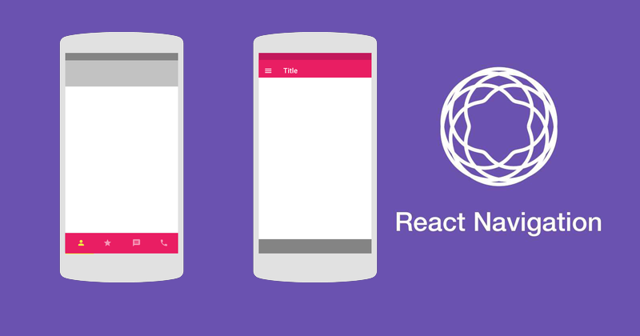

# Navigation in React Native

When you're building a mobile app, it will probably consist of multiple screens which the user will switch back and forth. Allowing the user to transition between different screens is a job of a navigator and this guide will cover it in detail. We will first understand how the navigation works followed by setting up navigation in your React Native application. Let's start.

## Concept
Navigation in apps works like a `Stack`.Consider a *Stack* which provides you the functionality to push or pop screens into it. This is exactly what's happening.  
When you navigate to a new screen, you actually `push` that screen into the *Stack*. It means that whenever you go to a new screen, it comes up on top. The *Stack* preserve the order in which you visited the screens and provides a smooth transition.
When you're going back, you're actually `popping out` the screen from the top of the *Stack*. You can visualize this with the example on a stack of books below:


We will need a navigator to perform these actions and [react - navigation](https://reactnavigation.org/) library provides an easy to use navigation solution for both Android and iOS. Let's setup `react-navigation` in our React Native app.

## React Navigation Setup
I'm assuming you already have your React Native or Expo app created and running. Let's go through the installation step quickly.

### Step 1. Install the react-navigation package in your React Native project.
```shell
yarn add react-navigation
```
or with npm
```shell
 npm install react-navigation
```

### Step 2. Install react native-gesture-handler and react-nativere-animated.
If you're using Expo, to ensure that you get the compatible versions of the libraries you should run:
```shell
expo install react-native-gesture-handler react-native-reanimated
```
Otherwise, just use yarn or npm directly:
```shell
yarn add react-native-gesture-handler react-native-reanimated
```
or with npm
```shell
npm install react-native-gesture-handler react-native-reanimated
```
### Step 3. Link libraries
Next, if you are not using the Expo managed workflow then you need to link these libraries if you haven't already. The steps depend on your React Native version:
* React Native 0.60 and higher  
On newer versions of React Native, linking is automatic.
On iOS, to complete the linking, make sure you have Cocoapods installed. Then run:
```shell
cd ios
pod install
cd ..
```
On Android, it shouldn't need any more steps. But if you get errors regarding Android Support library during building the app, you need to install and configure `jetifier`.

* React Native 0.59 and lower  
If you're on an older React Native version, you need to manually link the dependencies. To do that, run:  
```shell
react-native link react-native-reanimated
react-native link react-native-gesture-handler
```
To finalize the installation of `react-native-gesture-handler` for Android, be sure to make the necessary modifications to `MainActivity.java`:
```java
package com.reactnavigation.example;

import com.facebook.react.ReactActivity;
//Add these lines
import com.facebook.react.ReactActivityDelegate;
import com.facebook.react.ReactRootView;
import com.swmansion.gesturehandler.react.RNGestureHandlerEnabledRootView;

public class MainActivity extends ReactActivity {

  @Override
  protected String getMainComponentName() {
    return "Example";
  }

//Add this function
  @Override
  protected ReactActivityDelegate createReactActivityDelegate() {
    return new ReactActivityDelegate(this, getMainComponentName()) {
      @Override
      protected ReactRootView createRootView() {
       return new RNGestureHandlerEnabledRootView(MainActivity.this);
      }
    };
  }
}
```
Finally, run `react-native run-android` or `react-native run-ios` to launch the app on your device / simulator.

## Creating a Router and Navigating between screens
* Creating a router is pretty easy, we will create a file `Router.js` and import our screens in it.
```javascript
// Assuming you have two screens
import LoginScreen from './LoginScreen';
import HomeScreen from './HomeScreen';
```
* Now, we will create *Stack Navigator* by calling `createStackNavigator` and wrap it with `createAppContainer`.
```javascript
import LoginScreen from './LoginScreen';
import HomeScreen from './HomeScreen';
//import from react-navigation
import {createStackNavigator, createAppContainer} from 'react-navigation';

//creating stack navigator
const AuthStackNavigator = createStackNavigator({
  Login: {screen: LoginScreen},
  Home: {screen: HomeScreen},
});

//wrap the root navigator with createAppContainer
const Router = createAppContainer(AuthStackNavigator);

//export to the root file of your app
export default Router;
```
* Now we will navigate from LoginScreen to HomeScreen. Each screen component inside the navigator receives a *set of props* which we can use to perform navigation.
```javascript
class LoginScreen extends React.Component {

  render() {
    return (
      <View style={{ flex: 1, alignItems: 'center', justifyContent: 'center' }}>
        <Text>Login Screen</Text>
        <Button
          title="Go to Home"
          onPress={() => this.props.navigation.navigate('Home')}
        />
      </View>
    );
  }
}
//calling navigation.navigate on props with screen name that we set earlier
```

* Going back to a screen: The header provided by stack navigator will automatically include a back button when it is possible to go back from the active screen(when there is more than one screen).  
Sometimes you'll want to be able to programmatically trigger this behavior, and for that, you can use `this.props.navigation.goBack()`;.
```javascript
class HomeScreen extends React.Component {

  render() {
    return (
      <View style={{ flex: 1, alignItems: 'center', justifyContent: 'center' }}>
        <Text>Home Screen</Text>
        <Button
          title="Go back to Login"
          onPress={() => this.props.navigation.navigate('Login')}
        />
      </View>
    );
  }
}
```
* Go back multiple screens: Suppose you have multiple screens in your *Stack* and you want to dismiss all of them to go back to the first screen. In this case, you can use `navigation.popToTop()`.

## Types of Navigator
There are multiple navigator which the `react-navigation` provides.These are:
* createStackNavigator
* createSwitchNavigator
* createBottomTabNavigator
* createMaterialTopTabNavigator
* createDrawerNavigator

We will go through each of them quickly and see an example.

### 1. createStackNavigator
The Stack Navigator allows arranging the screen like *Stack* as we have already seen above. You can add or remove screens just as you push or pop inside a Stack.

### 2. createSwitchNavigator
SwitchNavigator shoes only one screen at a time and don't preserve any stack. It resets the screen when you navigate to a new screen hence there is no functionality of going back. This behavior can be very helpful when making an authentication flow. The example we wrote earlier can be updated as: 

```javascript
//creating SwitchNavigator in Auth flow ensures that the user can't go back after logging in. 
const AuthStackNavigator = createSwitchNavigator({
  Login: {screen: LoginScreen},
  Home: {screen: HomeScreen},
});

const Router = createAppContainer(AuthStackNavigator);

export default Router;
```

### 3. createBottomTabNavigator
You may have seen many apps with tab-based navigation. The tabs can be at the bottom or top of the screen that lets you switch between different screens.  
Bottom Tab Navigator is a simple tab bar on the bottom of the screen. Usage:
```javascript
import React from 'react';
import { Text, View } from 'react-native';
import { createBottomTabNavigator, createAppContainer } from 'react-navigation';

class HomeScreen extends React.Component {
  render() {
    return (
      <View style={{ flex: 1, justifyContent: 'center', alignItems: 'center' }}>
        <Text>Home!</Text>
      </View>
    );
  }
}

class SettingsScreen extends React.Component {
  render() {
    return (
      <View style={{ flex: 1, justifyContent: 'center', alignItems: 'center' }}>
        <Text>Settings!</Text>
      </View>
    );
  }
}

const TabNavigator = createBottomTabNavigator({
  Home: HomeScreen,
  Settings: SettingsScreen,
});

export default createAppContainer(TabNavigator);
```
### 4. createMaterialTopTabNavigator
A material-design themed tab bar on the top of the screen that lets you switch between different routes by tapping the route or swiping horizontally. Usage:
```javascript
createMaterialTopTabNavigator(RouteConfigs, TabNavigatorConfig);
```
### 5. createdDrawerNavigator
The Drawer Navigator allows you to present a navigation menu to your users. You can swipe right or left to open or close the drawer and switch between different screens. It provides a default Header which is common to all the screens inside Drawer Navigator. Go to this [link](https://reactnavigation.org/docs/en/drawer-based-navigation.html) to read more. Example:  

```javascript
class HomeScreen extends React.Component {
  render() {
    return (
      <View style={{ flex: 1, justifyContent: 'center', alignItems: 'center' }}>
        <TouchableOpacity onPress={this.props.navigation.openDrawer}>
          <Text>Open Drawer</Text>
        </TouchableOpacity>
        <Text style={{ fontWeight: 'bold', marginTop: 20 }}>Home</Text>
      </View>
    );
  }
}

class SettingsScreen extends React.Component {
  render() {
    return (
      <View style={{ flex: 1, justifyContent: 'center', alignItems: 'center' }}>
        <TouchableOpacity onPress={this.props.navigation.openDrawer}>
          <Text>Open Drawer</Text>
        </TouchableOpacity>
        <Text style={{ fontWeight: 'bold', marginTop: 20 }}>Settings</Text>
      </View>
    );
  }
}

const DrawerNavigator = createDrawerNavigator(
  {
    Home: HomeScreen,
    Settings: SettingsScreen,
  },
  {
    drawerBackgroundColor: 'rgba(255,255,255,.9)',
    contentOptions: {
      activeTintColor: '#fff',
      activeBackgroundColor: '#6b52ae',
    },
  }
);

export default createAppContainer(DrawerNavigator);
```
So we have covered all the basics of navigation in React Native. You can go through the [official website](https://reactnavigation.org/docs/en/api-reference.html) to know all the route configuration properties available.  
I hope you had fun learning React Native Navigations.